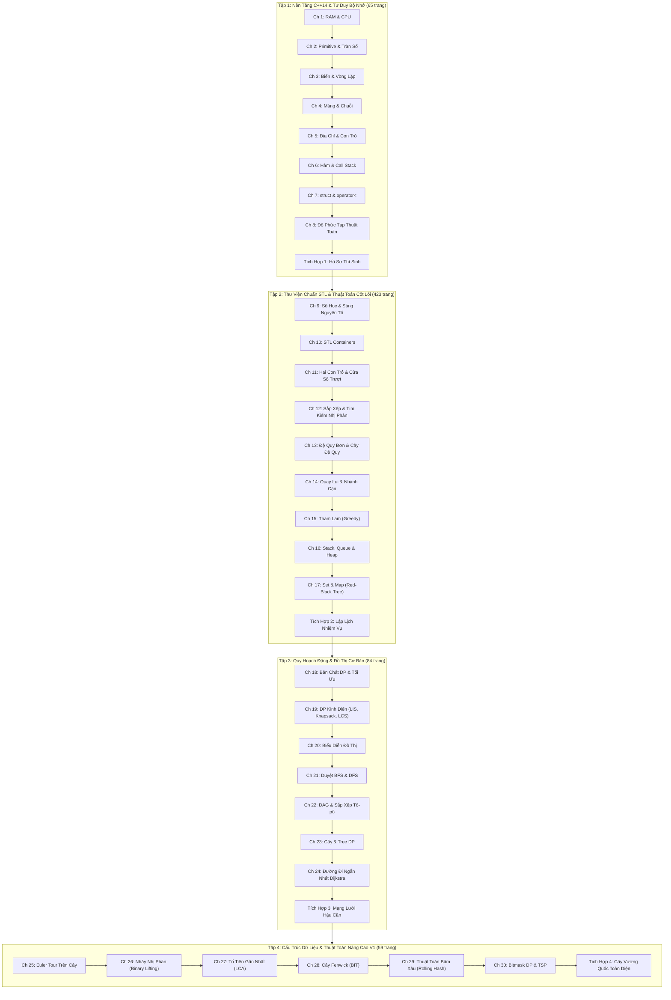

# Akashic Record: Thư Viện Lập Trình Thi Đấu C++14 Ngoại Tuyến

[](https://en.cppreference.com/w/cpp/14)
[](https://typst.app/)
[](https://starlight.astro.build/)
[-success.svg)](#hệ-thống-kiểm-chứng-tự-động)
[](#hướng-dẫn-in-ấn-sách-khổ-a4)

**Akashic Record** là hệ thống giáo trình, thư viện mã nguồn và nền tảng luyện thi Lập trình thi đấu (Competitive Programming) chuyên sâu bằng **C++14**. Dự án được thiết kế chuẩn mực phục vụ các kỳ thi Học sinh giỏi Quốc gia (VNOI), Olympic Tin học và kỳ thi lập trình sinh viên quốc tế ICPC.

Toàn bộ hệ thống được xây dựng trên triết lý **100% Unplugged Traceability** (khả năng chạy bàn trên giấy mà không cần máy tính) và lộ trình **Strict DAG** (đồ thị có hướng không chu trình nghiêm ngặt), tích hợp đồng bộ giữa **4 tập sách in A4 đơn sắc (Typst)**, **34 bài toán mẫu mực (340 test cases)** và **Cổng tra cứu trực tuyến tương tác (Astro Starlight)**.

---

## Mục Lục

1. [Triết Lý Sư Phạm Đột Phá](#triết-lý-sư-phạm-đột-phá)
2. [Cấu Trúc Lộ Trình 4 Tập Giáo Trình](#cấu-trúc-lộ-trình-4-tập-giáo-trình)
3. [Danh Mục 34 Bài Toán & Bộ Test Bàn Tay](#danh-mục-34-bài-toán--bộ-test-bàn-tay)
4. [Hướng Dẫn In Ấn Sách Khổ A4 Đơn Sắc](#hướng-dẫn-in-ấn-sách-khổ-a4-đơn-sắc)
5. [Cổng Tra Cứu Trực Tuyến & Chấm Bài Tương Tác](#cổng-tra-cứu-trực-tuyến--chấm-bài-tương-tác)
6. [Cấu Trúc Thư Mục Dự Án](#cấu-trúc-thư-mục-dự-án)
7. [Hướng Dẫn Sử Dụng & Lệnh Tự Động Hóa (Makefile)](#hướng-dẫn-sử-dụng--lệnh-tự-động-hóa-makefile)
8. [Đường Ống Kiểm Chứng Tự Động (CI Pipeline)](#đường-ống-kiểm-chứng-tự-động-ci-pipeline)

---

## Triết Lý Sư Phạm Đột Phá

Khác biệt với các tài liệu lập trình truyền thống phụ thuộc vào việc gõ code và thử-sai (trial-and-error) liên tục trên IDE, **Akashic Record** đặt trọng tâm vào năng lực tư duy tính toán cốt lõi:

```
  +-----------------------------------------------------------------+
  |                    TRIẾT LÝ SƯ PHẠM 4 TRỤ CỘT                  |
  +-----------------------------------------------------------------+
           |                           |                           |
  [100% Unplugged]             [Strict DAG Graph]            [C++14 Mechanics]
   Chạy bàn bằng bút            Không vay mượn                Mổ xẻ bộ nhớ RAM,
   chì trên giấy trắng          kiến thức chưa học            con trỏ & số bù 2
           \                           |                           /
            +--------------------------+--------------------------+
                                       |
                         [Bộ 10 Test Bàn Tay Chuẩn Mực]
                          Warm-up -> Edge -> Trick -> N<=8
```

### 1. 100% Unplugged Traceability (Chạy bàn trên giấy)
- Trong các kỳ thi Olympic, khả năng tư duy mô phỏng thuật toán bằng giấy bút quyết định 90% sự thành bại trước khi chạm tay vào bàn phím.
- Mỗi bài toán đều được trang bị **Bảng Ma Trận Vết Thực Thi (Trace Matrix)** ghi nhận chi tiết: chỉ số bước lặp, giá trị biến số, trạng thái mảng và con trỏ tại từng thời điểm. Học sinh có thể theo dõi và điền kết quả bằng bút chì hoàn toàn ngoại tuyến.

### 2. Lộ Trình Kiên Định Strict DAG (Không phụ thuộc vòng)
- Toàn bộ chương trình được sắp xếp theo cấu trúc đồ thị có hướng không chu trình.
- **Quy tắc vàng:** Không bao giờ sử dụng một cú pháp, khái niệm hay hàm thư viện nào mà chưa được định nghĩa và chứng minh ở các chương trước.
  - *Ví dụ:* Bản chất con trỏ & địa chỉ ô nhớ (Chương 5) bắt buộc phải học **trước** Hàm & Tham chiếu (Chương 6); Mảng tĩnh và con trỏ được học **trước** khi mổ xẻ `struct` và `operator<` (Chương 7).

### 3. C++14 Mechanics & Tiêu Chuẩn Tất Định
- Sử dụng chuẩn C++14 nguyên bản – tiêu chuẩn ổn định, tối ưu và được áp dụng phổ biến trong các hệ thống chấm tự động (Themis, CMS, VNOJ, Codeforces).
- Đi sâu vào bản chất phần cứng: dải ô nhớ $0$-based, số bù hai (Two's Complement), tràn số nguyên `int` vs `long long`, cơ chế sao chép vs tham chiếu `const &`, và tính bất biến của hàm thành viên `bool operator<(...) const`.

### 4. Bộ 10 Test Bàn Tay Chuẩn Mực (Pencil Slots)
Mỗi bài toán trong sách đều có bảng 10 test case được thiết kế có chủ đích sư phạm với ô trống điền bút chì `[ .................... ]`:
- **Test 1 - 3 (Warm-up):** Dữ liệu mẫu đơn giản, giúp học sinh nắm vững yêu cầu đề bài.
- **Test 4 - 6 (Edge / Boundary):** Giá trị biên đặc biệt (mảng rỗng, $N=1$, số $0$, số âm, cực trị).
- **Test 7 - 8 (Trick Cases):** Dữ liệu gài bẫy tư duy (dãy giảm dần, phần tử trùng nhau, đồ thị phân nhánh đặc biệt).
- **Test 9 - 10 (Mental Challenges):** Bài toán suy luận sâu với kích thước nhỏ ($N \le 8$) đòi hỏi tư duy phân tích đa tầng.

---

## Cấu Trúc Lộ Trình 4 Tập Giáo Trình

Bộ giáo trình gồm 4 tập liên hoàn với tổng cộng **631 trang A4**, **34 chương bài học** và **340 test cases**:



---

## Danh Mục 34 Bài Toán & Bộ Test Bàn Tay

| Tập | Chương / Bài Toán | Thư Mục Mã Nguồn | Chủ Đề & Thuật Toán Trọng Tâm | Số Test | Bảng Vết Typst |
| :---: | :--- | :--- | :--- | :---: | :--- |
| **1** | **Bài 1.1: RAM Swap** | `code/vol1/ch01_ram_swap/` | Tráo đổi biến số, dải ô nhớ RAM | 10 | `ch01_trace.typ` |
| **1** | **Bài 2.1: Safe Product** | `code/vol1/ch02_overflow/` | Tích an toàn, số bù hai, tràn `int` | 10 | `ch02_trace.typ` |
| **1** | **Bài 3.1: Collatz Trace** | `code/vol1/ch03_loop_trace/` | Vòng lặp Collatz, biến thiên biến số | 10 | `ch03_trace.typ` |
| **1** | **Bài 4.1: Array & Palindrome** | `code/vol1/ch04_array_string/` | Mảng 1D, chuỗi đối xứng hai đầu | 10 | `ch04_trace.typ` |
| **1** | **Bài 5.1: Pointer MinMax** | `code/vol1/ch05_pointer/` | Tìm min/max bằng con trỏ thuần túy | 10 | `ch05_trace.typ` |
| **1** | **Bài 6.1: Call Stack GCD** | `code/vol1/ch06_call_stack/` | GCD Euclid, khung ngăn xếp gọi hàm | 10 | `ch06_trace.typ` |
| **1** | **Bài 7.1: Point Struct Sort** | `code/vol1/ch07_struct_cmp/` | Cấu trúc tọa độ, so sánh `operator<` | 10 | `ch07_trace.typ` |
| **1** | **Bài 8.1: Loop Operation Count** | `code/vol1/ch08_complexity/` | Đếm thao tác cơ bản, đánh giá Big-O | 10 | `ch08_trace.typ` |
| **1** | **Tích hợp 1: Student Records** | `code/vol1/integrated/` | Mảng con trỏ + `struct` + Selection Sort | 10 | `integrated_trace.typ` |
| **2** | **Bài 9.1: Prime Sieve Segment** | `code/vol2/ch09_number_theory/` | Sàng số nguyên tố Eratosthenes | 10 | `ch09_trace.typ` |
| **2** | **Bài 10.1: STL Vector & Iterator** | `code/vol2/ch10_stl_sequential/` | `std::vector`, thao tác Iterator | 10 | `ch10_trace.typ` |
| **2** | **Bài 11.1: Two Pointers Subarray** | `code/vol2/ch11_two_pointers/` | Hai con trỏ, đoạn con tổng không vượt $S$ | 10 | `ch11_trace.typ` |
| **2** | **Bài 12.1: Binary Search Bound** | `code/vol2/ch12_sort_binary_search/` | Phân đoạn `lower_bound`, `upper_bound` | 10 | `ch12_trace.typ` |
| **2** | **Bài 13.1: Recursion Tree Trace** | `code/vol2/ch13_recursion_tree/` | Dãy Fibonacci, cây gọi đệ quy phân nhánh | 10 | `ch13_trace.typ` |
| **2** | **Bài 14.1: Subset Backtracking** | `code/vol2/ch14_backtracking/` | Quay lui sinh tập con, nhánh cận | 10 | `ch14_trace.typ` |
| **2** | **Bài 15.1: Interval Scheduling** | `code/vol2/ch15_greedy/` | Lập lịch công việc không giao nhau (Greedy) | 10 | `ch15_trace.typ` |
| **2** | **Bài 16.1: Monotonic Stack Next Greater** | `code/vol2/ch16_stack_queue/` | Ngăn xếp đơn điệu tìm phần tử lớn hơn | 10 | `ch16_trace.typ` |
| **2** | **Bài 17.1: Set & Map Frequency** | `code/vol2/ch17_set_map/` | Đếm tần suất với cây đỏ - đen `map` | 10 | `ch17_trace.typ` |
| **2** | **Tích hợp 2: Multi-Task Scheduler** | `code/vol2/integrated/` | Phối hợp Greedy + Priority Queue + Set | 10 | `integrated_trace.typ` |
| **3** | **Bài 18.1: Coin Change Trace** | `code/vol3/ch18_dp_foundations/` | Đổi tiền xu ít nhất, bảng phương án DP | 10 | `ch18_trace.typ` |
| **3** | **Bài 19.1: 0/1 Knapsack & LIS** | `code/vol3/ch19_classic_dp/` | Balo 0/1 và Dãy con tăng dài nhất | 10 | `ch19_trace.typ` |
| **3** | **Bài 20.1: Adjacency Representations** | `code/vol3/ch20_graph_representation/` | Chuyển đổi Ma trận kề & Danh sách kề | 10 | `ch20_trace.typ` |
| **3** | **Bài 21.1: BFS & DFS Connected Components** | `code/vol3/ch21_bfs_dfs/` | Tìm thành phần liên thông, đường đi ngắn nhất | 10 | `ch21_trace.typ` |
| **3** | **Bài 22.1: Kahn Topo & Longest DAG Path** | `code/vol3/ch22_dag_toposort/` | Thứ tự Tô-pô (Kahn) & Đường đi dài nhất | 10 | `ch22_trace.typ` |
| **3** | **Bài 23.1: Tree Subtree Size & Diameter** | `code/vol3/ch23_trees/` | Kích thước cây con & Đường kính của cây | 10 | `ch23_trace.typ` |
| **3** | **Bài 24.1: Dijkstra Shortest Path** | `code/vol3/ch24_dijkstra/` | Đường đi ngắn nhất nguồn đơn với Heap | 10 | `ch24_trace.typ` |
| **3** | **Tích hợp 3: Kingdom Logistics** | `code/vol3/integrated/` | Mô hình hóa đồ thị + Dijkstra + DAG DP | 10 | `integrated_trace.typ` |
| **4** | **Bài 25.1: Euler Tour & Subtree Queries** | `code/vol4/ch25_euler_tour/` | Trải phẳng cây, đoạn liên tiếp `[tin, tout]` | 10 | `ch25_trace.typ` |
| **4** | **Bài 26.1: Functional Binary Lifting** | `code/vol4/ch26_binary_lifting/` | Nhảy nhị phân tìm $f^{(K)}(x)$ trong $O(\log K)$ | 10 | `ch26_trace.typ` |
| **4** | **Bài 27.1: LCA on Tree & Distances** | `code/vol4/ch27_lca/` | Tổ tiên chung gần nhất & Khoảng cách cây | 10 | `ch27_trace.typ` |
| **4** | **Bài 28.1: Fenwick Tree Inversion Counting** | `code/vol4/ch28_fenwick_tree/` | Cây BIT, $lowbit(i)$, đếm số cặp nghịch thế | 10 | `ch28_trace.typ` |
| **4** | **Bài 29.1: String Hashing & Palindrome** | `code/vol4/ch29_string_hashing/` | Băm đa thức tiền tố, Rabin-Karp, Palindrome | 10 | `ch29_trace.typ` |
| **4** | **Bài 30.1: Bitmask DP & TSP** | `code/vol4/ch30_bitmask_dp/` | Duyệt trạng thái mặt nạ bit, bài toán TSP | 10 | `ch30_trace.typ` |
| **4** | **Tích hợp 4: Kingdom Tree Infrastructure** | `code/vol4/integrated/` | Phối hợp Euler Tour + Fenwick + Binary Lifting | 10 | `integrated_trace.typ` |

---

## Hướng Dẫn In Ấn Sách Khổ A4 Đơn Sắc

Tất cả 4 tập sách được dàn trang chuyên nghiệp bằng hệ thống **Typst** với các thông số kỹ thuật tối ưu hóa cho in ấn hai mặt và photocopy học đường:

```
  +-------------------------------------------------------------+
  |              THÔNG SỐ DÀN TRANG SÁCH IN A4                  |
  +-------------------------------------------------------------+
  - Khổ giấy:          A4 Chuẩn Quốc Tế (210 x 297 mm)
  - Chế độ màu:        Thuần Đen - Trắng (Monochrome High-Contrast)
  - Lề gáy trong:      28 mm (Binding Gutter cho đóng gáy xoắn/keo)
  - Lề ngoài:          22 mm (Thuận tiện cầm đọc và ghi chú bút chì)
  - Lề trên / dưới:    25 mm (Header / Footer đối xứng trang chẵn/lẻ)
  - Cỡ chữ nội dung:   10.5 pt Serif, dãn dòng 1.35
  - Mã nguồn:          Monospace đơn khoảng có số dòng rõ ràng
  +-------------------------------------------------------------+
```

### Các tập sách PDF sẵn sàng in tại `web/public/pdf/`:
- **`vol1.pdf` (65 trang | 1.6 MB):** Tập 1 – Nền Tảng C++14 & Tư Duy Bộ Nhớ.
- **`vol2.pdf` (423 trang | 12 MB):** Tập 2 – Thư Viện Chuẩn STL & Kỹ Thuật Thuật Toán Cốt Lõi.
- **`vol3.pdf` (84 trang | 1.9 MB):** Tập 3 – Quy Hoạch Động & Đồ Thị Cơ Bản.
- **`vol4.pdf` (59 trang | 1.4 MB):** Tập 4 – Cấu Trúc Dữ Liệu & Thuật Toán Nâng Cao V1.

### Khuyến nghị khi đem in:
1. **In hai mặt (Duplex Printing):** Chọn kiểu lật theo cạnh dài (*Flip on long edge*).
2. **Tỷ lệ trang:** Chọn *Actual Size* (100%), không chọn *Fit to Page* để giữ chuẩn kích thước lề $28\text{ mm} / 22\text{ mm}$.
3. **Đóng gáy:** Lề $28\text{ mm}$ ở cạnh trong bảo đảm đóng gáy lò xo, gáy xoắn hoặc dán nhiệt đều không bị lẹm vào phần văn bản.

---

## Cổng Tra Cứu Trực Tuyến & Chấm Bài Tương Tác

Bên cạnh sách in giấy, dự án cung cấp cổng tài liệu web tương tác xây dựng bằng **Astro v5 + Starlight**:

- **Công thức toán học chuẩn mực:** Hỗ trợ toàn diện ký hiệu LaTeX qua KaTeX (`remark-math` + `rehype-katex`).
- **Tìm kiếm tĩnh ngoại tuyến:** Tích hợp bộ tìm kiếm **Pagefind** tích hợp sẵn trong bản build, hoạt động 100% ngoại tuyến mà không phụ thuộc máy chủ bên ngoài.
- **Interactive Checker Component (`<InteractiveChecker />`):**
  - Nhúng trực tiếp tại từng chương bài tập.
  - Cho phép học sinh nhập kết quả tính nhẩm trên giấy của 10 bài test.
  - Tự động đối chiếu tức thì với đáp án chuẩn, phản hồi trạng thái `AC` / `WA`.
  - Mở bảng vết thực thi từng bước (Execution Trace Table) để học sinh kiểm tra từng biến số sai lệch ở bước nào.

Khởi động giao diện web cục bộ:
```bash
cd web
npm install
npm run dev
# Mở trình duyệt tại http://localhost:4321
```

---

## Cấu Trúc Thư Mục Dự Án

```
AkashicRecord/
├── code/                          # Mã nguồn tham chiếu C++14 & bộ 10 test case
│   ├── vol1/ (ch01..ch08, int)    # 9 bài toán Tập 1
│   ├── vol2/ (ch09..ch17, int)    # 10 bài toán Tập 2
│   ├── vol3/ (ch18..ch24, int)    # 8 bài toán Tập 3
│   └── vol4/ (ch25..ch30, int)    # 7 bài toán Tập 4
├── typst/                         # Mã nguồn dàn trang sách in khổ A4
│   ├── templates/                 # Book theme & mẫu trình bày chuyên nghiệp
│   ├── vol1/..vol4/               # Cấu trúc từng tập sách (main.typ, chapters, appendix)
│   └── */generated/               # Bảng ma trận vết thực thi Typst tự động sinh
├── web/                           # Cổng tra cứu trực tuyến Astro Starlight
│   ├── src/content/docs/          # Tài liệu MDX từng chương của 4 tập
│   ├── src/components/            # Component tương tác (InteractiveChecker.astro)
│   ├── public/pdf/                # 4 tệp PDF bản in (vol1.pdf đến vol4.pdf)
│   └── dist/                      # Sản phẩm build tĩnh sau khi đóng gói
├── tools/                         # Bộ công cụ tự động hóa & kiểm chứng
│   ├── build_all.sh               # Kịch bản Shell điều phối toàn diện
│   └── verifier/                  # Bộ chấm tự động & sinh bảng vết thực thi
│       ├── run_verifier.py        # Trình biên dịch C++14, chấm test & sinh vết
│       ├── test_verifier.py       # Unit test Pytest cho verifier
│       └── trace_logger.hpp       # Header C++ hỗ trợ xuất vết thực thi
├── Makefile                       # Tự động hóa build với các lệnh tiêu chuẩn
└── README.md                      # Hướng dẫn chi tiết dự án (tệp này)
```

---

## Hướng Dẫn Sử Dụng & Lệnh Tự Động Hóa (Makefile)

Dự án cung cấp `Makefile` và kịch bản `tools/build_all.sh` với các mục tiêu tiêu chuẩn:

### Bảng Lệnh Makefile

| Lệnh | Ý Nghĩa & Tác Vụ Thực Hiện |
| :--- | :--- |
| `make all` | **Chạy toàn bộ quy trình:** Chạy kiểm chứng 34 bài toán $\to$ Biên dịch 4 tập PDF $\to$ Xây dựng cổng web tĩnh. |
| `make test` | **Kiểm thử tự động:** Chạy Pytest và kiểm chứng toàn bộ 34 bài toán C++14 (340/340 test cases 100% AC). |
| `make pdf` | **Biên dịch sách:** Dùng Typst biên dịch toàn bộ 4 tập sách A4 xuất ra `web/public/pdf/`. |
| `make web` | **Build cổng web:** Dùng Astro Starlight đóng gói trang tĩnh ra thư mục `web/dist/`. |
| `make clean` | **Dọn dẹp hệ thống:** Xóa các thư mục build tạm thời (`web/dist`, `web/.astro`, `.pytest_cache`, v.v.). |
| `make help` | Hiển thị bảng trợ giúp hướng dẫn các lệnh khả dụng. |

### Thực thi trực tiếp qua Shell Script

Bạn cũng có thể chạy trực tiếp script điều phối:
```bash
# Cấp quyền thực thi (nếu cần)
chmod +x tools/build_all.sh

# Chạy toàn bộ quy trình
./tools/build_all.sh all

# Chạy kiểm chứng 34 bài toán
./tools/build_all.sh test

# Biên dịch riêng 4 tập PDF
./tools/build_all.sh pdf

# Đóng gói cổng web tĩnh
./tools/build_all.sh web

# Dọn dẹp cache
./tools/build_all.sh clean
```

---

## Đường Ống Kiểm Chứng Tự Động (CI Pipeline)

Hệ thống kiểm chứng tự động bảo đảm tính chính xác tuyệt đối giữa code C++, sách in Typst và dữ liệu web:

```
  [solution.cpp] + [trace_logger.hpp]
                  |
         (g++ -std=c++14 -O2 -DENABLE_TRACE)
                  |
          [Binary thực thi]
                  |
     <--- [tests.json (10 tests)]
                  |
                  v
       [run_verifier.py]
      /                 \
     v                   v
[typst/.../generated/]   [web/.../tests/]
  (*_trace.typ)            (*.json)
```

1. **`trace_logger.hpp`:** Thư viện header C++ siêu nhẹ, hỗ trợ các macro theo dõi trạng thái:
   - `TRACE_STEP(step_num, message)`: Ghi nhận bước lặp logic.
   - `TRACE_VAR(var_name, value)`: Ghi nhận giá trị biến số nguyên, chuỗi, bool, pair.
   - `TRACE_ARRAY(array_name, ptr, size)`: Ghi nhận trạng thái mảng tĩnh hoặc con trỏ.
2. **`run_verifier.py`:**
   - Biên dịch nghiệm C++14 với cờ `-O2 -Wall -DENABLE_TRACE`.
   - Nạp 10 test case từ `tests.json`, thực thi và so sánh kết quả chuẩn.
   - Trích xuất dữ liệu vết từ luồng `stderr`.
   - Tự động sinh bảng Typst `#trace-table(...)` cho phụ lục sách in.
   - Tự động sinh tệp JSON tương thích cho component `<InteractiveChecker />` trên web.

---

## Yêu Cầu Môi Trường (Prerequisites)

Để phát triển hoặc build dự án từ mã nguồn, môi trường cần cài đặt:

- **Hệ điều hành:** Linux, macOS hoặc Windows (WSL2).
- **Trình biên dịch C++:** `g++` (GCC) hỗ trợ `-std=c++14`.
- **Python:** Phiên bản 3.8+ (khuyến nghị có cài đặt `pytest`).
- **Typst CLI:** Phiên bản 0.11+ ([Cài đặt Typst](https://github.com/typst/typst)).
- **Node.js & npm:** Node.js 18+ và npm 9+ ([Cài đặt Node.js](https://nodejs.org/)).

---

## Bản Quyền & Giấy Phép

Dự án **Akashic Record** được phát triển nhằm phụng sự cộng đồng giáo dục tin học và các thế hệ học sinh giỏi thuật toán Việt Nam. Mọi tài liệu và mã nguồn được phân phối dưới giấy phép giáo dục mở.
